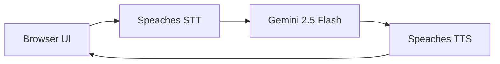
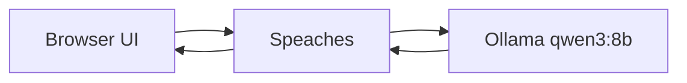

<p align="center">
  <h1 align="center">Voya Voice Assistant</h1>
</p>

<p align="center">
  <strong>React + Vite + TypeScript ile çalışan yerel wake-word sesli asistan arayüzü.</strong>
</p>

<p align="center">
  
  
  
  
  
  
</p>

Bu uygulama bilgisayarınızda çalışan Speaches servisine bağlanır. Mikrofonla konuşursunuz, uygulama sesi Speaches'a gönderir, cevap metin ve ses olarak geri gelir.

Öne çıkanlar:

- Wake word desteği: örnek `hey assistant`.
- Türkçe ve İngilizce konuşma algılama.
- Varsayılan İngilizce öğretmeni prompt'u.
- Local Ollama veya Gemini 2.5 Flash seçimi.
- Telefon/tablet için ev ağı QR kodu.
- Backend yazmadan çalışan frontend. Tarayıcı Ollama'ya doğrudan istek atmaz.

Gemini modunda tarayıcı, Speaches ile STT/TTS yapar ve transcribed metni Gemini API'ye gönderir. Local modda tarayıcı yalnızca Speaches'a konuşur; Speaches Ollama'ya proxy eder.

## İçindekiler

- [Önce Bunu Seçin](#önce-bunu-seçin)
- [Mimari](#mimari)
- [Gereksinimler](#gereksinimler)
- [Kurulum Özeti](#kurulum-özeti)
- [Speaches Ortak Kurulumu](#2-speaches-ortak-kurulumu)
- [Gemini Kurulumu](#3a-gemini-kurulumu)
- [Local Kurulum](#3b-local-kurulum)
- [Telefon veya Tablet ile Kullanma](#5-telefon-veya-tablet-ile-kullanma)
- [Türkçe Desteği](#6-türkçe-desteği)
- [Sorun Giderme](#8-sorun-giderme)
- [License](#license)

## Önce Bunu Seçin

Bu projeyi iki farklı şekilde kullanabilirsiniz.

| Kurulum yolu | Ollama gerekir mi? | Gemini API key gerekir mi? | Ne zaman seçilir? |
| --- | --- | --- | --- |
| `Gemini kurulumu` | Hayır | Evet | Local LLM kurmak istemiyorsanız veya daha kolay başlamak istiyorsanız. |
| `Local kurulum` | Evet | Hayır | Her şey bilgisayarınızda kalsın istiyorsanız. |

Ortak nokta: İki kurulumda da Speaches gerekir. Speaches konuşmayı yazıya çevirir ve cevabı seslendirir.

## Mimari

### Gemini Modu



Gemini modunda Ollama ve `qwen3:8b` gerekmez.

### Local Mod



Local modda Gemini API key gerekmez.

## Gereksinimler

### Her iki kurulum için gerekli

- Git
- Node.js 20 veya daha yeni
- Docker Desktop
- Chrome, Edge veya Safari
- Speaches Docker container
- Speaches STT/TTS modelleri

### Sadece Gemini kurulumu için gerekli

- Gemini API key
- Ollama gerekmez
- `qwen3:8b` indirmeniz gerekmez

Gemini API key almak için Google AI Studio kullanabilirsiniz:

https://aistudio.google.com/app/apikey

### Sadece Local kurulum için gerekli

- Ollama
- `qwen3:8b` Ollama modeli
- Gemini API key gerekmez

Ollama indirme sayfası:

https://ollama.com/download

### Telefon/tablet kullanacaksanız

- Telefon ve PC aynı Wi-Fi ağında olmalı.
- Mobil mikrofon için HTTPS gerekir.
- LAN sertifikası önerilir.

## Kurulum Özeti

1. Repoyu indirin.
2. `npm install` çalıştırın.
3. Speaches için `speaches.env` oluşturun.
4. Speaches Docker container'ını başlatın.
5. Speaches STT/TTS modellerini indirin.
6. Gemini kullanacaksanız Ollama adımlarını atlayın.
7. Local kullanacaksanız Ollama kurup `qwen3:8b` indirin.
8. `npm run dev` çalıştırın.
9. `https://localhost:5173` adresini açın.

## 1. Repoyu İndirme

GitHub repo sayfasında `Code` -> `HTTPS` ile repo URL'sini alın.

```powershell
git clone YOUR_REPO_URL
cd YOUR_REPO_FOLDER
```

Bağımlılıkları kurun:

```powershell
npm install
```

## 2. Speaches Ortak Kurulumu

Bu bölüm hem Gemini hem Local kurulum için gereklidir.

Speaches şu işlerden sorumludur:

- Mikrofon sesini yazıya çevirmek.
- Cevabı WAV ses dosyasına çevirmek.
- Local modda chat isteğini Ollama'ya proxy etmek.

### 2.1 `speaches.env` Dosyası

Proje klasöründe `speaches.env` dosyası oluşturun.

Gemini kullanacaksanız bu dosya yeterlidir:

```env
LOOPBACK_HOST_URL=http://localhost:8000
ALLOW_ORIGINS=["http://localhost:5173","http://127.0.0.1:5173","http://YOUR_PC_LAN_IP:5173","https://localhost:5173","https://127.0.0.1:5173","https://YOUR_PC_LAN_IP:5173"]
```

Local Ollama kullanacaksanız bunu kullanın:

```env
CHAT_COMPLETION_BASE_URL=http://host.docker.internal:11434/v1
LOOPBACK_HOST_URL=http://localhost:8000
ALLOW_ORIGINS=["http://localhost:5173","http://127.0.0.1:5173","http://YOUR_PC_LAN_IP:5173","https://localhost:5173","https://127.0.0.1:5173","https://YOUR_PC_LAN_IP:5173"]
```

`YOUR_PC_LAN_IP` değerini bilmiyorsanız şimdilik olduğu gibi bırakabilirsiniz. Uygulama açıldıktan sonra `Assistant settings` -> `Phone access` bölümü bilgisayarınızın LAN adresini gösterir. Telefon kullanacaksanız bu değeri daha sonra güncelleyip Speaches'ı yeniden başlatabilirsiniz.

### 2.2 Speaches'ı Docker ile Başlatma

Docker Desktop açık olmalı.

CPU sürümü:

```powershell
docker run `
  --rm `
  --detach `
  --publish 8000:8000 `
  --name speaches `
  --volume hf-hub-cache:/home/ubuntu/.cache/huggingface/hub `
  --env-file speaches.env `
  ghcr.io/speaches-ai/speaches:0.9.0-rc.3-cpu
```

NVIDIA GPU kullanıyorsanız CUDA sürümü:

```powershell
docker run `
  --rm `
  --detach `
  --publish 8000:8000 `
  --name speaches `
  --volume hf-hub-cache:/home/ubuntu/.cache/huggingface/hub `
  --gpus=all `
  --env-file speaches.env `
  ghcr.io/speaches-ai/speaches:0.9.0-rc.3-cuda
```

Çalıştığını kontrol edin:

```powershell
Invoke-RestMethod http://localhost:8000/health
```

### 2.3 Speaches STT/TTS Modellerini İndirme

Bu modeller iki kurulum yolunda da gerekir.

| Görev | Model |
| --- | --- |
| Konuşmayı yazıya çevirme | `Systran/faster-whisper-small` |
| Cevabı sese çevirme | `speaches-ai/Kokoro-82M-v1.0-ONNX` |
| Ses | `af_heart` |

PowerShell ile indirin:

```powershell
$env:SPEACHES_BASE_URL = "http://localhost:8000"
Invoke-RestMethod -Method Post "$env:SPEACHES_BASE_URL/v1/models/Systran/faster-whisper-small"
Invoke-RestMethod -Method Post "$env:SPEACHES_BASE_URL/v1/models/speaches-ai/Kokoro-82M-v1.0-ONNX"
```

İlk indirme birkaç dakika sürebilir.

Alternatif olarak Speaches CLI kullanabilirsiniz:

```powershell
$env:SPEACHES_BASE_URL = "http://localhost:8000"
uvx speaches-cli model download Systran/faster-whisper-small
uvx speaches-cli model download speaches-ai/Kokoro-82M-v1.0-ONNX
uvx speaches-cli model ls
```

## 3A. Gemini Kurulumu

Ollama kurmak istemiyorsanız bu yolu kullanın.

Bu kurulumda:

- Ollama gerekmez.
- `qwen3:8b` gerekmez.
- Gemini API key gerekir.
- Speaches yine gerekir.

Adımlar:

1. [Speaches ortak kurulumunu](#2-speaches-ortak-kurulumu) tamamlayın.
2. Uygulamayı başlatın:

```powershell
npm run dev
```

3. Tarayıcıda açın:

```text
https://localhost:5173
```

4. `Assistant settings` bölümünü açın.
5. `LLM Provider` değerini `Global Gemini API` yapın.
6. `Gemini API Key` alanına API key girin.
7. `Wake` butonuna basıp konuşun.

Not: API key tarayıcı local storage içinde saklanır. Bu kullanım yerel geliştirme için uygundur. Public bir web sitesinde API key'i frontend içinde tutmayın.

## 3B. Local Kurulum

Her şey yerel bilgisayarınızda kalsın istiyorsanız bu yolu kullanın.

Bu kurulumda:

- Ollama gerekir.
- `qwen3:8b` gerekir.
- Gemini API key gerekmez.
- Speaches gerekir.

### 3B.1 Ollama Kurulumu

Ollama henüz yoksa önce buradan kurun:

https://ollama.com/download

Kurulumdan sonra PowerShell açıp kontrol edin:

```powershell
ollama --version
```

Komut bulunamazsa Ollama kurulumunu tamamlayın, terminali kapatıp tekrar açın.

### 3B.2 `qwen3:8b` Modelini İndirme

Ollama kurulduktan sonra modeli indirin:

```powershell
ollama run qwen3:8b
```

Bu komut model yoksa indirir, sonra modeli çalıştırır.

Modelin indiğini kontrol etmek için:

```powershell
ollama list
```

Ollama varsayılan olarak burada çalışır:

```text
http://localhost:11434
```

### 3B.3 Uygulamayı Local Modda Kullanma

1. [Speaches ortak kurulumunu](#2-speaches-ortak-kurulumu) local `speaches.env` ile tamamlayın.
2. Uygulamayı başlatın:

```powershell
npm run dev
```

3. Tarayıcıda açın:

```text
https://localhost:5173
```

4. `Assistant settings` bölümünde `LLM Provider` değeri `Local Speaches + Ollama` olmalı.
5. `Wake` butonuna basıp konuşun.

## 4. Kullanım

Wake-word kullanımı:

1. `Wake` butonuna basın.
2. Wake word söyleyin. Varsayılan: `hey assistant`.
3. Sorunuzu veya cümlenizi söyleyin.
4. Sustuktan sonra sistem sesi işler.
5. Cevap metin olarak görünür ve sesli çalınır.
6. Sonraki konuşma için tekrar wake word gerekir.

Manuel kullanım:

1. `Record` butonuna basın.
2. Konuşun.
3. `Stop` butonuna basın.
4. Sistem cevabı üretir.

## 5. Telefon veya Tablet ile Kullanma

Telefon mikrofonu için sayfa HTTPS ile açılmalıdır. `http://...` mobil tarayıcıda mikrofon için yeterli değildir.

Sadece bilgisayardan kullanacaksanız bu bölümü atlayabilirsiniz.

### 5.1 LAN IP Bulma

Windows PowerShell:

```powershell
ipconfig
```

Wi-Fi altında görünen `IPv4 Address` değerini alın.

Örnek:

```text
192.168.1.242
```

Bu değeri `speaches.env` içindeki `YOUR_PC_LAN_IP` yerine yazın ve Speaches container'ını yeniden başlatın.

### 5.2 HTTPS Sertifikası Oluşturma

Mobil mikrofon için HTTPS gerekir. Bu proje `certs/lan-cert.pem` ve `certs/lan-key.pem` dosyaları varsa Vite'ı HTTPS ile başlatır.

OpenSSL kuruluysa PowerShell'de çalıştırın. `192.168.1.242` değerini kendi PC IP adresinizle değiştirin:

```powershell
$env:LAN_IP = "192.168.1.242"
New-Item -ItemType Directory -Force certs
& "C:\Program Files\OpenSSL-Win64\bin\openssl.exe" req -x509 -newkey rsa:2048 -days 3650 -nodes -keyout certs/local-ca-key.pem -out certs/local-ca.pem -subj "/CN=Speaches Local Dev CA" -addext "basicConstraints=critical,CA:TRUE" -addext "keyUsage=critical,keyCertSign,cRLSign"
@"
subjectAltName=DNS:localhost,IP:127.0.0.1,IP:$env:LAN_IP
basicConstraints=CA:FALSE
keyUsage=digitalSignature,keyEncipherment
extendedKeyUsage=serverAuth
"@ | Set-Content certs/lan.ext
& "C:\Program Files\OpenSSL-Win64\bin\openssl.exe" req -newkey rsa:2048 -nodes -keyout certs/lan-key.pem -out certs/lan.csr -subj "/CN=$env:LAN_IP"
& "C:\Program Files\OpenSSL-Win64\bin\openssl.exe" x509 -req -in certs/lan.csr -CA certs/local-ca.pem -CAkey certs/local-ca-key.pem -CAcreateserial -out certs/lan-cert.pem -days 825 -sha256 -extfile certs/lan.ext
& "C:\Program Files\OpenSSL-Win64\bin\openssl.exe" x509 -outform der -in certs/local-ca.pem -out certs/speaches-local-ca.cer
```

Sonra `npm run dev` komutunu yeniden başlatın.

### 5.3 QR Kod ile Açma

PC'de uygulamayı açın:

```text
https://localhost:5173
```

Sonra:

1. `Assistant settings` bölümünü açın.
2. `Phone access` bölümüne gidin.
3. `Phone QR` butonuna basın.
4. Telefonda aynı Wi-Fi ağına bağlıyken QR kodu okutun.

QR kod şu formatta bir adres açar:

```text
https://YOUR_PC_LAN_IP:5173
```

Telefon sertifika uyarısı gösterirse `certs/speaches-local-ca.cer` dosyasını telefona kurup güvenilir yapmanız gerekebilir.

iPhone için:

1. `.cer` dosyasını telefona gönderin.
2. Profili yükleyin.
3. Settings -> General -> About -> Certificate Trust Settings bölümünden tam güven verin.

Android'de menü isimleri cihaza göre değişebilir. Kullanıcı sertifikaları veya güvenilir sertifikalar bölümünden yükleyin.

## 6. Türkçe Desteği

Uygulama Türkçe konuşmayı anlayacak şekilde ayarlanmıştır.

Varsayılan davranış:

- Türkçe veya İngilizce konuşabilirsiniz.
- STT modeli `Systran/faster-whisper-small` olduğu için Türkçe girişi anlayabilir.
- Asistan varsayılan olarak İngilizce öğretmenidir.
- Türkçe konuşsanız bile basit İngilizce cevap verir.
- Her cevapta yalnızca bir önemli İngilizce hatayı düzeltmeye çalışır.

Neden Türkçe cevap vermiyor?

Mevcut TTS sesi `af_heart`, İngilizce için daha uygundur. Türkçe metin seslendirilirse aksan kötü olabilir. Bu yüzden varsayılan prompt İngilizce cevap verir.

Türkçe cevap istiyorsanız `Assistant settings` -> `System Role` alanını değiştirebilirsiniz. Ancak ses kalitesi mevcut TTS modeliyle iyi olmayabilir.

## 7. Ayarlar

| Alan | Açıklama |
| --- | --- |
| `LLM Provider` | `Local Speaches + Ollama` veya `Global Gemini API`. |
| `Speaches Base URL` | Genelde `https://localhost:5173` kalmalı. Vite `/v1` isteklerini Speaches'a proxy eder. |
| `Wake Word` | Uyandırma kelimesi. Örnek: `hey assistant`, `hey mobil`, `merhaba asistan`. |
| `System Role` | Asistanın karakterini ve cevap dilini belirleyen prompt. |
| `Phone access` | Telefon için LAN URL ve QR kod. |
| `Debug` | Durum, hata, transcript ve raw response bilgileri. |

Varsayılan prompt'u dosyadan değiştirmek için:

```powershell
Copy-Item .env.example .env.local
```

Sonra `.env.local` içindeki `VITE_SYSTEM_PROMPT` değerini değiştirin ve `npm run dev` komutunu yeniden başlatın.

## 8. Sorun Giderme

### `ollama` komutu bulunamıyor

Ollama kurulu değildir veya terminal eski PATH ile açıktır.

Çözüm:

1. Ollama'yı kurun: https://ollama.com/download
2. PowerShell'i kapatıp tekrar açın.
3. Kontrol edin:

```powershell
ollama --version
```

Gemini kurulumu kullanıyorsanız Ollama kurmanız gerekmez.

### `qwen3:8b` modeli yok

Bu sadece Local kurulum için gerekir.

```powershell
ollama run qwen3:8b
```

Gemini kurulumu kullanıyorsanız bu adımı atlayın.

### Speaches çalışmıyor

Kontrol edin:

```powershell
Invoke-RestMethod http://localhost:8000/health
```

Container durumunu kontrol edin:

```powershell
docker ps
docker logs --tail 120 speaches
```

### Browser `Failed to fetch` gösteriyor

Olası sebepler:

- Speaches çalışmıyor.
- `ALLOW_ORIGINS` eksik.
- `LOOPBACK_HOST_URL` eksik.
- Speaches env değişikliğinden sonra container yeniden başlatılmadı.

### Speaches Ollama'ya ulaşamıyor

Local kurulumda `speaches.env` içinde şu değer olmalı:

```env
CHAT_COMPLETION_BASE_URL=http://host.docker.internal:11434/v1
```

Ollama çalışıyor mu kontrol edin:

```powershell
ollama list
```

### Telefonda sayfa açılmıyor

Kontrol edin:

- Telefon ve PC aynı Wi-Fi ağında mı?
- VPN kapalı mı?
- Windows Firewall Node/Vite için private network erişimine izin veriyor mu?
- Router'da client isolation/AP isolation açık mı?
- QR içindeki IP doğru mu?
- IP değiştiyse `npm run dev` yeniden başlatıldı mı?

### Telefonda mikrofon çalışmıyor

Kontrol edin:

- Adres `https://...` ile başlamalı.
- `http://...` mobil mikrofon için yeterli değildir.
- Sertifika telefonda güvenilir olmalı.
- Chrome, Edge veya Safari gibi gerçek tarayıcı kullanın.
- Bazı uygulama içi tarayıcılar mikrofon API'lerini engeller.

### QR kod görünmüyor

Çözüm:

1. Sayfayı yenileyin.
2. `Assistant settings` bölümünü açın.
3. `Phone access` -> `Phone QR` butonuna basın.
4. Hala görünmüyorsa `npm run dev` komutunu yeniden başlatın.

### Cevap sesi otomatik başlamıyor

Mobil tarayıcılar bazen otomatik ses çalmayı engeller.

Çözüm:

- Önce `Wake` veya `Record` butonuna dokunun.
- `Play response` butonu çıkarsa bir kez dokunun.
- Audio player görünüyorsa oradan oynatın.

### İlk cevap yavaş

İlk istekte STT, LLM ve TTS modelleri belleğe yüklenir. İlk cevap yavaş olabilir. Sonraki cevaplar daha hızlı olur.

### Türkçe ses kötü duyuluyor

`af_heart` sesi İngilizce için daha uygundur. Türkçe metin seslendirilirse aksan kötü olabilir. Daha kaliteli Türkçe ses için Türkçe destekli ayrı bir TTS modeli gerekir.

## Geliştirici Notları

Ana dosyalar:

| Dosya | Açıklama |
| --- | --- |
| `src/App.tsx` | UI, wake word, kayıt, provider seçimi. |
| `src/audio.ts` | WAV ve base64 işlemleri. |
| `src/speaches.ts` | Speaches API istekleri. |
| `src/gemini.ts` | Gemini API isteği. |
| `src/qr.ts` | Telefon bağlantısı için QR üretimi. |
| `vite.config.ts` | HTTPS sertifikası, LAN IP algılama, `/v1` proxy. |

Komutlar:

```powershell
npm run dev
npm run build
```

## License

Voya is source-available under the PolyForm Noncommercial License 1.0.0.

You may use, copy, modify, and distribute this software for noncommercial purposes.

Commercial use is not permitted without a separate paid commercial license from the author.

For commercial licensing, contact:

- GitHub: https://github.com/delamis

See:

- `LICENSE`
- `COMMERCIAL.md`

## English Quick Start

Choose one setup path first.

Gemini path:

1. Install Node.js and Docker Desktop.
2. Create `speaches.env` without `CHAT_COMPLETION_BASE_URL`.
3. Start Speaches with Docker.
4. Download the STT/TTS Speaches models.
5. Run `npm install`.
6. Run `npm run dev`.
7. Open `https://localhost:5173`.
8. Select `Global Gemini API` and enter your Gemini API key.

Local path:

1. Install Node.js, Docker Desktop, and Ollama.
2. Run `ollama run qwen3:8b`.
3. Create `speaches.env` with `CHAT_COMPLETION_BASE_URL=http://host.docker.internal:11434/v1`.
4. Start Speaches with Docker.
5. Download the STT/TTS Speaches models.
6. Run `npm install`.
7. Run `npm run dev`.
8. Open `https://localhost:5173`.

The assistant understands Turkish and English input. By default it replies in simple English because the current Kokoro voice is English-oriented.

## References

- Speaches installation docs: https://speaches.ai/installation/
- Speaches voice chat docs: https://speaches.ai/usage/voice-chat/
- Speaches STT docs: https://speaches.ai/usage/speech-to-text/
- Speaches TTS docs: https://speaches.ai/usage/text-to-speech/
